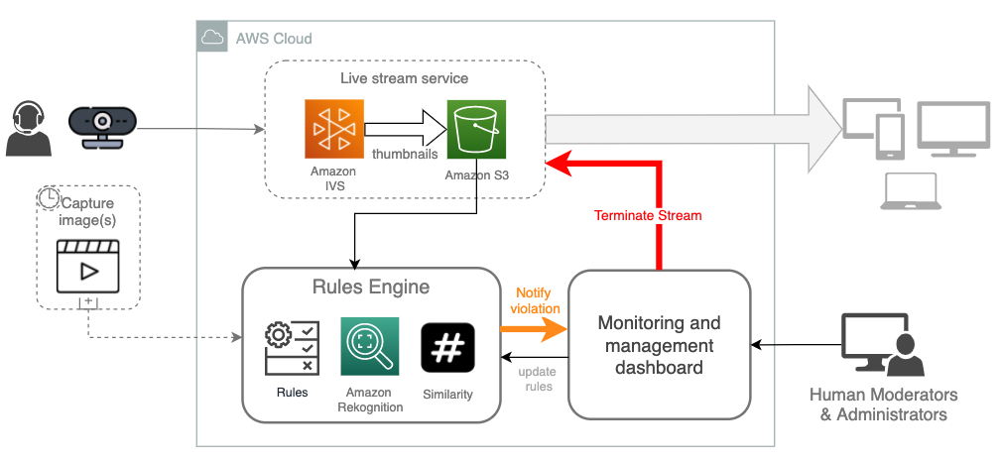
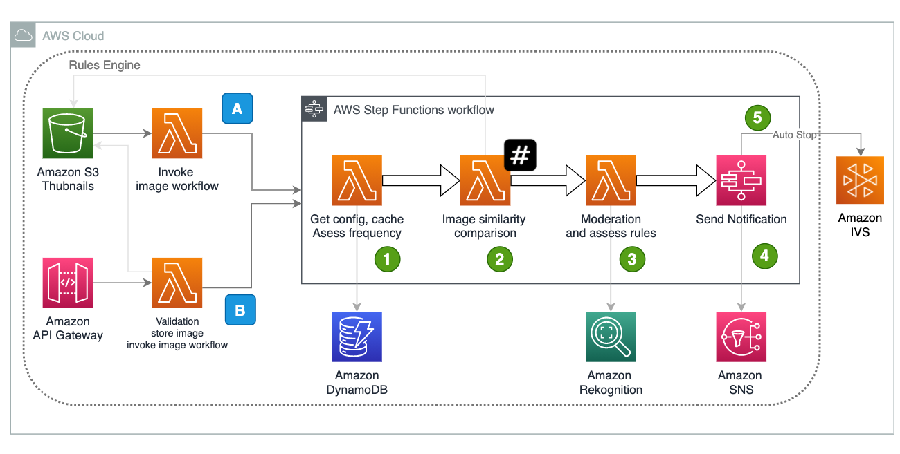
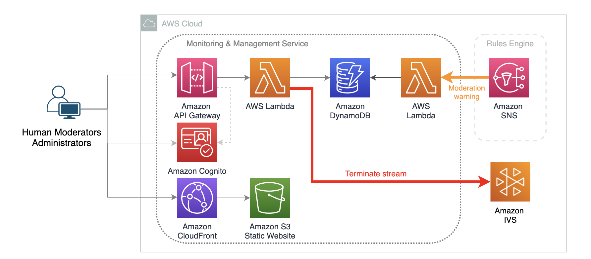

# AWS AI Content Moderation Live Stream PoC-in-a-box

> :warning: The repository has been updated to incorporate the Amazon Rekognition moderation V7 taxonomy by March 7th, 2024. Please note that you may encounter compatibility issues before your account is migrated to V7.

With the increased usage of live streaming, the need for effective content moderation becomes even more crucial. User generated content (UGC) presents complex challenges for safety. Many companies rely on human moderators to monitor the video streams, which is time-consuming, error-prone, and doesn't scale with business growth speed. An automated moderation solution supporting human-in-the-loop (HITL) is increasingly needed.

This solution is designed to assist live stream customers using AWS IVS or other solutions in quickly setting up a proof of concept (PoC) for visual moderation with Amazon Rekognition. You can deploy this solution into your AWS account using the CDK package.

## Overview

The screen recording below displays the moderator UI, enabling human moderators to monitor active streams with moderation warnings, and take actions such as terminating the stream or dismissing warnings. 


The screen recording below displays the UI for managing a global configuration:


## Prerequisites

- If you don't have the AWS account administrator access, ensure your [IAM](https://aws.amazon.com/iam/) role/user has permissions to create and manage the necessary resources and components for this solution.
- In the same AWS account, ensure that you have created at least one IVS channel with recording enabled. We will require the name of the IVS recording S3 bucket as an input for the [CDK](https://aws.amazon.com/cdk/) application deployment. Please refer [this document](https://docs.aws.amazon.com/ivs/latest/LowLatencyUserGuide/getting-started-create-channel.html) for detailed instructions on how to create an IVS channel with recording enabled.

## Supported AWS regions
The Live Stream moderation solution requires AWS services, including Amazon IVS and Amazon Rekognition, which are available in certain regions. Please choose one of the below AWS regions to deploy the CDK package.

|||||
---------- | ---------- | ---------- | ---------- |
US | us-east-1 (N. Virginia) | us-west-2 (Oregan) ||
Europe | eu-west-1 (Ireland) | eu-central-1 (Frankfurt) ||
Asia | ap-south-1 (Mumbai) | ap-northeast-1 (Tokyo) | ap-northeast-2 (Seoul) |

## Install environment dependencies and set up authentication

<details><summary>
:bulb: Skip if using CloudShell or AWS services that support bash commands from the same account (e.g., Cloud9). Required for self-managed environments like local desktops.
</summary>

- [ ] Install Node.js
https://nodejs.org/en/download/

- [ ] Install Python 3.8+
https://www.python.org/downloads/

- [ ] Install Git
https://github.com/git-guides/install-git

- [ ] Install Pip
```sh
python -m ensurepip --upgrade
```

- [ ] Install Python Virtual Environment
```sh
pip install virtualenv
```


- [ ] Setup the AWS CLI authentication
```sh
aws configure                                                                     
 ```                      
</details>


If your CloudShell instance has older dependency libraries like npm or pip, it may cause deployment errors. To resolve this, click 'Actions' and choose 'Delete AWS CloudShell Home Directory' to start a fresh instance.

### Deploy the CDK package using CloudShell
1. Clone the source code from GitHub repo 
```
git clone https://github.com/aws-samples/aws-ai-content-moderation-livestream
cd aws-ai-content-moderation-livestream
```

2. Set up environment varaibles 
- Update the values with your target AWS account ID and the region where you intend to deploy the livestream moderation demo application.
```
export CDK_DEFAULT_ACCOUNT=YOUR_ACCOUNT_ID
export CDK_DEFAULT_REGION=YOUR_TARGET_REGION (e.x, us-east-1)
```
Set environment variables as input parameters for the CDK deployment package:

CDK_INPUT_USER_EMAILS: Email address(es) for login to the Livestream moderation portal. They will receive temporary passwords.
```
export CDK_INPUT_USER_EMAILS=EMAILS_SPLIT_BY_COMMA
```
CDK_INPUT_IVS_RECORDING_S3_BUCKET: The S3 bucket configured in IVS for storing thumbnails. Please refer to the Prerequisites section for instructions. 

> :warning: **Please ensure that:**
- The S3 bucket is located in the same AWS account and region specified by the environment variables CDK_DEFAULT_ACCOUNT and CDK_DEFAULT_REGION. 
- The S3 bucket does not have notifications configured for the 'ivs/v1' prefix, as this may disrupt CDK functionality.
- The IAM role/user is granted permissions to create an S3 Lambda trigger and has read access to the files in the specified bucket.
- Please always encrypt objects in the S3 bucket using a KMS key. [Refer to document](https://docs.aws.amazon.com/AmazonS3/latest/userguide/UsingKMSEncryption.html).
```
export CDK_INPUT_IVS_RECORDING_S3_BUCKET=IVS_RECORDING_S3_BUCKET_NAME
```

3. Run **deploy-cloudshell.sh** in CloudShell to deploy the application to your AWS account with the parameters defined in step 2.
```sh
bash deploy-cloudshell.sh
```

### Access the Livestream Moderation Web Portal
Once the deployment completes, you can find the website URL in the bash console. You can also find it in the CloudFormation console by checking the output in stack **CmLivestream-RootStack**.

An email with a username and temporary password will be sent to the email(s) you provided in step 2. Users can use this information to log in to the Livestream moderation web portal.


## Solution Architecture

This sample solution integrates with Amazon IVS by reading thumbnail images from an S3 bucket and sending images to the Rekognition image moderation API. It provides choices for automatic stream termination and HITL (human-in-the-loop) review. You can configure rules for the system to automatically halt streams based on conditions. It also includes a light human review web portal, empowering moderators to monitor streams, manage violation alerts, and terminate streams when necessary.

The solution adopted a microservices architecture which consists of two key components loosely coupled with Amazon IVS:


### Rules Engine

The Rules Engine forms the backbone of the live stream moderation system. It is a live processing service that enables near-real-time moderation. It utilizes Rekognition to moderate images, validates results against customizable rules, employs image hashing algorithms to recognize and exclude similar images, and can halt streams automatically or alert the Human Review Subsystem upon rule violations. The service integrates with IVS through S3-based image reading and facilitates API invocation via API Gateway.

The following architecture diagram illustrates the near-real-time moderation workflow:


Users can customizing moderation rules, controlling video stream sample frequency per channel, configuring Rekognition moderation categories with confidence thresholds, and enabling similarity checks - which ensures performance and cost optimization by avoiding process redundant images.

### Monitoring and management dashboard
The system is a serverless web app, featuring a static React frontend hosted on Amazon S3 with Amazon CloudFront for caching. Authentication is handled by Amazon Cognito. Data is served through Amazon API Gateway and AWS Lambda, with state storage in Amazon DynamoDB.


The monitoring dashboard is a lightweight demo app that provides essential features for moderators. To enhance functionality, you can extend the implementation to support multiple moderators with a management system and reduce latency by implementing a push mechanism using web sockets.